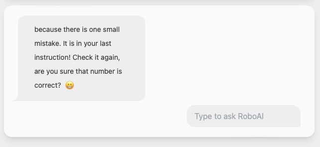

# RoboLab: Learn How to Code via Virtual Robotics Programming

RoboLab is a final project for Hauptseminar 'LLMs in Education' held in the Summer Semester 2024 at the University of Tübingen.

My collaborators created the prompt and the poster, and I am the sole author of the code. The main functionality was built using JavaScript. The site design was done using <a href="https://tailwindcss.com">Tailwind</a> with an additional package called <a href="https://daisyui.com">DaisyUI</a> and theming was achieved using <a href="https://github.com/saadeghi/theme-change">CSS Theme Change</a>. I also used <a href="https://github.com/WebCoder49/code-input">code-input</a> for IDE-like user window. Robot icon created by <a href="https://www.flaticon.com/free-icons/robot" title="robot icons">Freepik - Flaticon</a>. No AI-generated code was used in this project.

## Web App

The app allows students to write simple code to instruct a robot to walk on a line. They can be assisted by an AI with a special prompt, and it's 'personality' can be adjusted in settings. The AI can answer their questions and assess code they wrote. For more information, see our [poster](LLMsInEducationProjectRobotics_CapkanHanZeiner.pdf). You can also see the app in use in the [demo video](demo_video.mov).

### UI

### Settings affecting the AI's responses
RoboAI helping with incorrect code

RoboAI being not so helpful - by design

